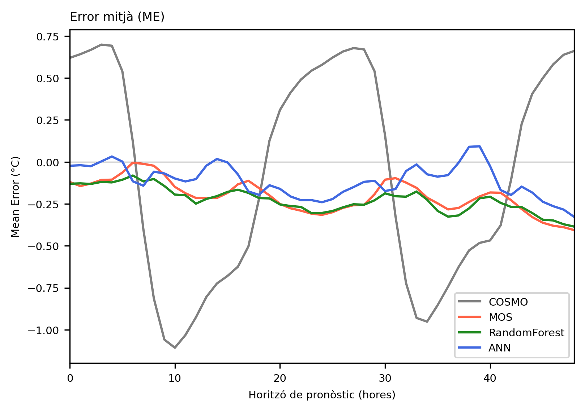

# Postprocessing Temperature Forecasts in Emilia-Romagna

This repository contains the postprocessing of COSMO model temperature forecasts using ARPAE open data service and AWS station data from Emilia-Romagna.

## Contents

1. **Data Processing**:
    - **AWS Temperature Data**: Scripts to process and obtain Parquet file databases for AWS (Automatic Weather Stations) temperature data. These scripts ensure that the raw temperature data from the AWS is formatted and stored efficiently in Parquet files for easy access and analysis.
    - **COSMO Model Variables**: Scripts to extract and process COSMO model variables relevant to each station location. The COSMO model provides numerical weather predictions, and these scripts align the model output with the geographic locations of the AWS stations. The data is also stored in Parquet files.

2. **Postprocessing Methodologies**:
    - **MOS (Model Output Statistics)**: This statistical method adjusts model forecasts based on historical performance. It uses multiple linear regressions to correct biases in the COSMO model temperature forecasts by relating them to observed temperature data. An MLR is calculated for each AWS and for each lead time of the COSMO model.
    - **Random Forest**: This machine learning technique uses an ensemble of decision trees to improve the accuracy of temperature forecasts. The Random Forest model is trained on historical COSMO model outputs and corresponding observed temperatures to learn patterns and improve future predictions. A Random Forest model is obtained for each AWS and for each lead time of the COSMO model.
    - **Neural Networks**: This deep learning approach leverages neural networks to model complex relationships between input variables and temperature forecasts. The neural network is trained on a large dataset of COSMO model outputs and AWS temperature observations, capturing non-linear patterns and interactions to enhance forecast accuracy. In this case a single model is trained, since station-specific corrections are achieved through the Embedding of their ID.

## Results

The results of the postprocessing methodologies indicate that the neural network approach yields the best performance in improving temperature forecasts. As shown in the figure below, the neural network model significantly reduces forecast mean error (ME) and mean absolute error (MAE) compared to the original COSMO model outputs and other postprocessing methods.

## Data Sources

Data is extracted from the [ARPAE open data service](https://dati.arpae.it/), which provide comprehensive and high-quality meteorological data for the Emilia-Romagna region. This data includes real-time and historical weather observations from AWS stations, as well as model output from the COSMO numerical weather prediction system.
